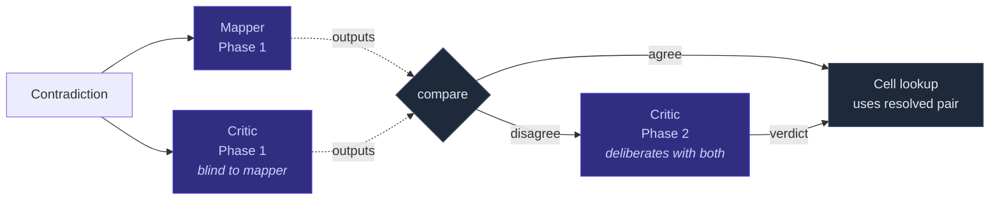
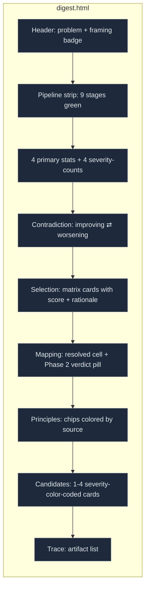
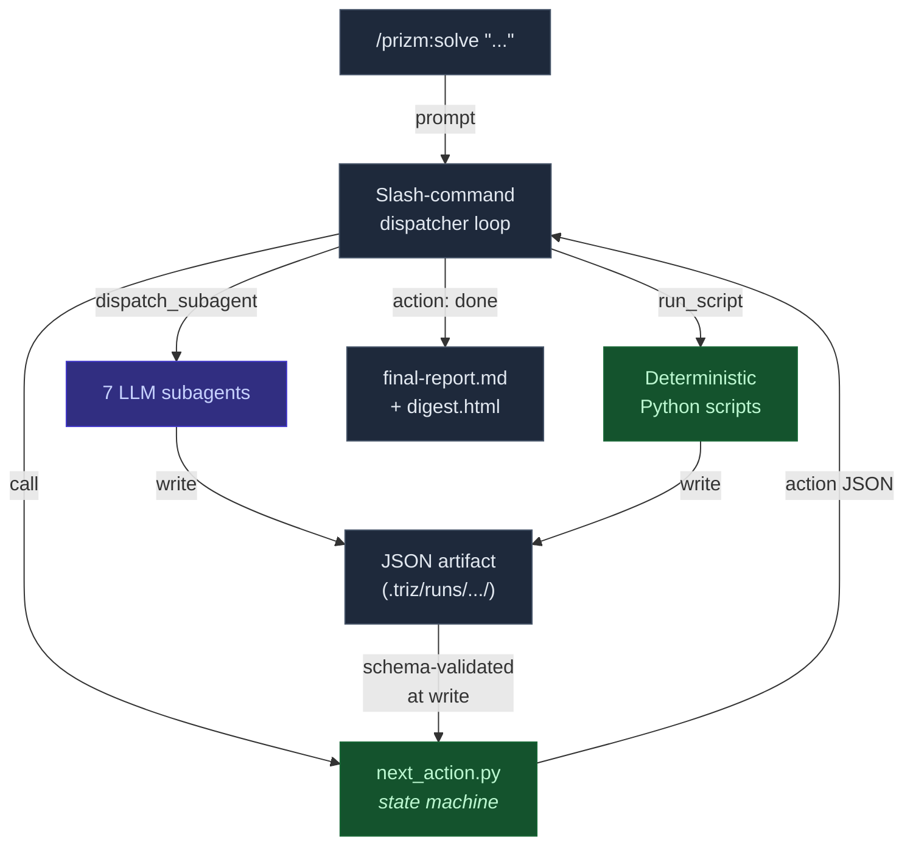

# prizm

**Refract one problem through multiple TRIZ contradiction matrices. Keep their distinct framings.**

A Claude Code plugin that turns the contradiction-matrix corpus of TRIZ — including the canonical Altshuller 39×39, BioTRIZ, a healthcare-service hybrid, and an LLM-curated 50-parameter extension — into a working multi-agent inventive-problem-solving pipeline. Every step writes an auditable JSON artifact; every run produces both a Markdown report and a self-contained HTML digest.

[](prizm/tests/)
[](LICENSE)
[](https://github.com/anthropics/claude-code)

---

## What it does

Given a problem statement like:

```
/prizm:solve "Reduce car body weight without losing crash safety."
```

prizm runs a 9-stage pipeline that:


…and produces:

- **`final-report.md`** — Markdown report with the contradiction, selected matrix, mapped parameters, principles, 2–4 candidate solutions, and a per-candidate critique.
- **`digest.html`** — Self-contained dark-theme HTML digest you can open from disk. Stat cards, pipeline strip, severity-color-coded candidate cards, collapsible drill-downs.
- **9–13 JSON artifacts** under `.triz/runs/<run-id>/` — every stage's output, schema-validated at write time.

See a real run: [`docs/examples/digest-nfc-attestation.html`](https://htmlpreview.github.io/?https://github.com/czemelman/claude-triz-workshop/blob/main/docs/examples/digest-nfc-attestation.html) (rendered HTML; the [Markdown version](docs/examples/final-report-nfc-attestation.md) is also in the repo).

---

## What makes it different

Most "TRIZ + AI" wrappers in the wild are single-shot prompts. prizm is built around three properties most of them are missing:

### 1. Two-phase mapping critic with structural blinding

When a parameter mapper proposes "*Ease of Operation × Reliability*" for your contradiction, how do you know it's not anchored on the first plausible answer? prizm runs the mapper and an independent critic *in parallel*, with the critic's prompt structurally blind to the mapper's output. If they agree, you proceed. If they disagree, the critic enters a deliberation phase and writes a verdict — `agree`, `disagree`, or `propose_third`. The state-driver picks whichever cell the critic's verdict resolved to.



### 2. Multi-matrix triangulation with heterogeneity awareness

prizm ships nine permissively-licensed matrices spanning four distinct lineages:

| Lineage | Matrices | What it specializes in |
|---|---|---|
| `altshuller-40` | `altshuller_39x39`, `altshuller_russian_original`, `heinrich_39x39` | Classic engineering contradictions (mechanical, materials, manufacturing) |
| `triz-ai-extended` | `triz_ai_50x50` | Software, security, scalability, sustainability — parameters absent from the original 39 |
| `biotriz-40` | `biotriz_6x6_bio`, `biotriz_6x6_tech`, `biotriz_24x24` | Biomimetic / operational-fields biology framing |
| `service-quality` | `healthcare_servqual` | SERVQUAL-style service-experience contradictions |

When two or more matrices score near each other in selection, prizm can run them **in parallel** and preserve their distinct framings through to synthesis — *interpretations* are deduped per `(canonical_id, interpretation_lineage)` so a BioTRIZ angle on "Segmentation" and an Altshuller angle on "Segmentation" both reach the final report.

### 3. The state machine is in Python, not the prompt

The orchestrator (an LLM) is a one-shot dispatcher: it calls `next_action.py`, gets back exactly one JSON action, executes it, and loops. There is no multi-turn reasoning chain that can drift mid-run. The 17-stage state machine — including framing-confidence checks, fatal-severity branches, retry caps, and the no-clean-mapping fallback — lives in 1300 lines of testable Python. 145 tests; the state-driver itself has 82% line coverage.

---

## Quick start

### Install (recommended — via marketplace)

Inside Claude Code:

```
/plugin marketplace add czemelman/claude-triz-workshop
/plugin install prizm@prizm
/reload-plugins
```

The matrix corpus ships bundled inside the plugin (`prizm/data/`) — no env var required.

### Use it

```
/prizm:list                                # see what matrices are available
/prizm:explain altshuller_39x39            # registry metadata + use-case for one matrix
/prizm:solve "Increase pipeline throughput without raising compute cost."
```

After the run completes (~40–90 seconds for a typical problem), the report path is printed:

```
final report → .triz/runs/run-<timestamp>/final-report.md
digest       → .triz/runs/run-<timestamp>/digest.html
```

Open the HTML digest in any browser — it's a single file, no server needed.

### Local dev install (alternative)

```bash
git clone git@github.com:czemelman/claude-triz-workshop.git ~/dev/claude-triz-workshop
ln -s ~/dev/claude-triz-workshop/prizm ~/.claude/plugins/prizm
```

### Override the corpus location

If you maintain your own curated matrix corpus elsewhere:

```bash
export TRIZ_MATRICES_PATH=/path/to/your/corpus   # must contain registry.json
```

---

## Where it's useful

prizm is for problems where you can clearly state *what you want to improve* and *what gets worse when you do*. Concretely:

### Engineering design tradeoffs *(matrix: `altshuller_39x39` / `heinrich_39x39`)*
> *"Reduce the weight of the brake caliper without increasing wear rate."*
> *"Improve injection-mold cycle time without losing part dimensional accuracy."*

Classic Altshuller territory. The 39×39 matrix has 1244 cells and ~75 years of patent analysis backing it.

### Software architecture decisions *(matrix: `triz_ai_50x50`)*
> *"Tighten authentication latency without compromising token-rotation cadence."*
> *"Scale event-ingest throughput without losing per-tenant fairness."*

The extended 50-parameter set adds dimensions absent from classical TRIZ: security, controllability, scalability, information capacity, harmful emissions (e.g. log volume), compatibility. Use this when your contradiction touches things Altshuller never saw.

### Biomimetic and sustainability problems *(matrix: `biotriz_6x6_bio`)*
> *"Make the surface self-cleaning without adding an active component."*
> *"Capture water from humid air without continuous power."*

BioTRIZ reorganises the contradiction space around **operational fields** that biology uses — substance, energy, information, space, time, structure. Solutions tend to surface analogues like lotus-leaf hierarchical textures or beetle hygroscopic patches.

### Healthcare and service-design tensions *(matrix: `healthcare_servqual`)*
> *"Reduce patient wait time without increasing clinician burnout."*
> *"Improve telehealth diagnostic accuracy without lengthening the consult."*

A SERVQUAL × TRIZ hybrid; specialised for service-quality gaps where the parameters don't map well onto physical-product TRIZ.

### Cross-domain problems where you don't know which matrix to use
> *"Bond a microelectronic sensor to skin for 30 days without irritation, manufacturing complexity, or biocompatibility risk."*

Run it through prizm and let the selector triangulate. When two matrices score within 15 % of each other, the state-driver flips to parallel-run strategy and you get cross-framing angles in the final report.

### Teaching and methodology research
Every artifact is JSON. Every run is replayable. The full state trace is on disk. Use it to teach TRIZ to students who want to see *why* a particular cell was chosen, or to write papers comparing matrix lineages on a labelled corpus of problems.

---

## What you get back

The HTML digest mirrors `final-report.md` but is built for fast visual scanning:



Each candidate card shows:
- **Severity badge** — green (minor), amber (moderate), orange (severe), red (fatal). Critique threshold colors are calibrated to the design v6 §17.3 thresholds.
- **Solution id** (`s1`, `s2`, …) — stable ordinal you can pass to `--exclude` on re-runs.
- **Novelty / effort** estimates.
- **Principles applied** as monospace chips.
- **Collapsible drill-downs**: implementation sketch, contributing interpretations (with lineage), full critique with secondary contradictions and risks.

[**View the live sample digest**](https://htmlpreview.github.io/?https://github.com/czemelman/claude-triz-workshop/blob/main/docs/examples/digest-nfc-attestation.html)
*(a real run resolving an NFC-chip + blockchain authentication architecture)*

---

## Architecture at a glance



The **7 LLM subagents** are: `triz-problem-framer`, `triz-matrix-selector`, `triz-parameter-mapper`, `triz-mapping-critic`, `triz-principle-interpreter`, `triz-solution-synthesizer`, `triz-contradiction-critic`. Each has a narrow, well-scoped prompt and writes one JSON artifact conformant to a published schema.

The **9 deterministic Python scripts** handle anything that needs to be predictable: state transitions (`next_action.py`), matrix scoring (`select_matrix.py`), symbolic cell lookup (`lookup_principles.py`), map-reduce consolidation (`merge_interpretations.py`), Markdown assembly (`assemble_report.py`), HTML digest (`generate_digest.py`).

---

## Bundled matrices

| Matrix | License | Lineage | What it's for |
|---|---|---|---|
| `altshuller_39x39` | Public domain | `altshuller-40` | Classic engineering (1244 cells, the canonical) |
| `altshuller_russian_original` | Public domain | `altshuller-40` | Russian-language original of the canonical |
| `heinrich_39x39` | Apache-2.0 | `altshuller-40` | Curated 109-cell subset for ARIZ-style work |
| `triz_ai_50x50` | MIT | `triz-ai-extended` | LLM-curated 50-parameter extension (security, sustainability, scalability, etc.) |
| `biotriz_6x6_bio` | CC BY 4.0 | `biotriz-40` | Biology-derived contradiction resolutions (biomimetics) |
| `biotriz_6x6_tech` | CC BY 4.0 | `biotriz-40` | Technology-derived comparison submatrix |
| `biotriz_24x24` | CC BY 4.0 | `biotriz-40` | Expanded BioTRIZ with supplementary similarity/NEP data |
| `healthcare_servqual` | CC BY 4.0 | `service-quality` | Hybrid SERVQUAL × TRIZ for service quality problems |
| `innovatetriz_extended` | MIT | `altshuller-40` | Bilingual (Chinese / English) extended matrix |

**Not bundled (license-restricted):** `drug_safety_18x18` (CC BY-NC-ND 4.0) and `mann_matrix2003_48x48` (used-with-permission). See [`MATRICES_OPTIONAL.md`](MATRICES_OPTIONAL.md) for how to add them yourself.

---

## Layout

```
.
├── prizm/                            # the Claude Code plugin (this is what /plugin install grabs)
│   ├── .claude-plugin/plugin.json
│   ├── agents/                       # 7 LLM subagents
│   ├── commands/                     # 4 slash commands (solve, list, explain, replay)
│   ├── scripts/                      # 10 deterministic Python scripts
│   ├── schemas/                      # 11 JSON Schemas (artifact contracts)
│   ├── skills/triz-methodology/      # TRIZ methodology skill
│   ├── tests/                        # 145 tests (unit + integration + property + e2e_replay)
│   ├── eval/                         # 30 labeled cases + synthetic eval harness
│   └── data/                         # bundled matrix corpus
│       ├── matrices/
│       ├── use_cases/
│       ├── registry.json
│       └── selector_tags_vocabulary.json
│
├── docs/examples/                    # sample digest.html + final-report.md from real runs
├── validate_matrix.py                # strict v6 validator (reads from prizm/data/)
├── scripts/                          # corpus-maintenance scripts (migrate, normalize, regenerate)
├── triz_workshop_design.md           # full plugin design (v6, six adversarial-review rounds)
├── matrix_storage_design.md          # storage schema for the matrix corpus (v1.1)
├── meta_analysis.md                  # statistical analysis across matrices
├── redundancy_analysis.md            # which matrices are identical to which
├── LICENSES.md                       # per-matrix license matrix + attribution lines
└── MATRICES_OPTIONAL.md              # how to fetch the 2 non-bundled matrices
```

---

## When *not* to use this

Be honest about scope. prizm is not the right tool when:

- **There's no contradiction.** If you can't articulate one parameter that improves and another that worsens, TRIZ has nothing to add. Use an idea-generation tool like [brainstorm](https://github.com/czemelman/brainstorm) instead.
- **You need 20+ divergent options.** prizm produces 2–4 well-grounded candidates derived from the matrix cell. For ideation breadth, run a brainstorm tool first and use prizm to stress-test the top candidates.
- **Your domain is purely strategic / political.** The bundled matrices don't have governance lineages bundled (the `drug_safety_18x18` matrix that does is license-restricted). Service-experience problems route to `healthcare_servqual`; broader governance problems are out of scope until you add a governance matrix.
- **You need a polished slide-ready output.** The digest is for working sessions, not boardrooms. Pipe `final-report.md` through your preferred presentation generator.

---

## License & provenance

The plugin code is **MIT**. The matrix corpus is a mosaic of independently-licensed sources; see [`LICENSES.md`](LICENSES.md) for the full breakdown and attribution lines.

The plugin was built top-down from a written design (`triz_workshop_design.md` v6, six adversarial-review rounds) against a curated matrix corpus (`matrix_storage_design.md` v1.1, with formal amendments). The build was driven by a state-driver Python pattern (the state machine lives in code; the LLM is a one-shot dispatcher per turn). The eval routes 30/30 labelled cases through the expected branch (`normal` / `low_framing_confidence` / `no_clean_mapping`).

See the design docs in this repo for the *why* behind every architectural decision.

---

## Roadmap

- **v0.2** — `/prizm:replay <run-id>` end-to-end against a sample registry, per-matrix property-test strategy generators.
- **v0.3** — telemetry of dispatch failures and stage retries (currently invisible to `state.json`).
- **v1.0** — `--lang=zh` flag with Chinese-language subagent prompts (the bundled `innovatetriz_extended` matrix is bilingual; the rest of the pipeline isn't yet).

Track issues at [github.com/czemelman/claude-triz-workshop/issues](https://github.com/czemelman/claude-triz-workshop/issues).
